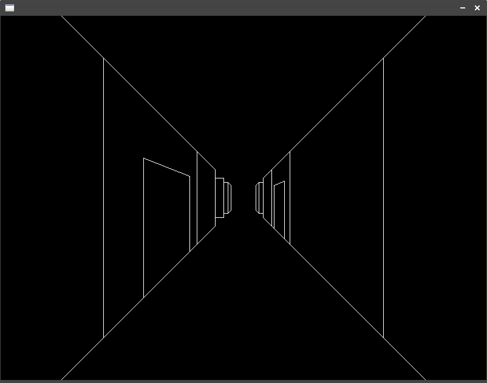
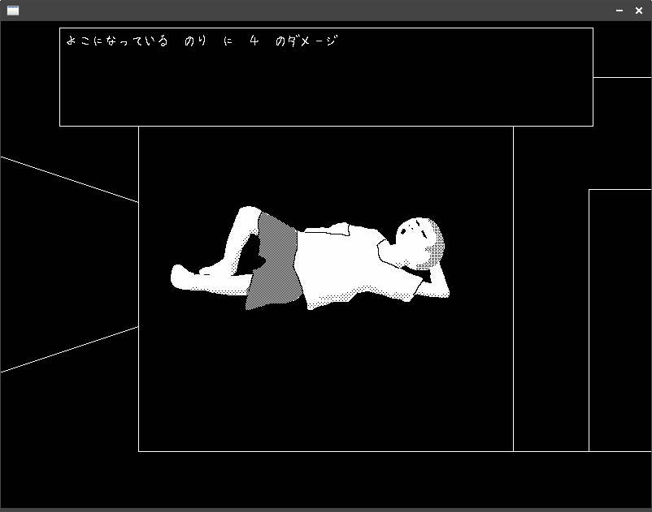

# xclhb-game-wireframe-3d-dungeon

Wizardry風3Dダンジョンゲーム

## 必要なもの
- Xサーバー
- Common Lisp(用Quicklisp)

## インストール
ソースのダウンロード（git clone もしくはソースをzipでダウンロードして ~/common-lisp に展開）
``` sh
cd ~/common-lisp
git clone https://github.com/yoshida2koji/struct-plus.git
git clone https://github.com/yoshida2koji/xclhb.git
git clone https://github.com/yoshida2koji/xclhb-game-wireframe-3d-dungeon.git
```

プロジェクトのルートディレクトリに移動
``` sh
cd xclhb-game-wireframe-3d-dungeon
```

処理系の起動
Roswell経由の場合
``` sh
ros run
```
sbclを直接起動する場合
``` sh
sbcl
``` 

ゲーム起動
``` lisp
(ql:quickload :xclhb-game-wireframe-3d-dungeon)
(xclhb-game-wireframe-3d-dungeon:start)
```

## 操作方法
| キー | 移動時  | 選択 |
| ---- | ---- | ---- |
| Enter | ドアを開けて進む | 決定 |
| Space | メニューを開く | キャンセル |
| Up, W, K | 前へ進む | カーソルを上へ移動 |
| Down, S, J | 後ろを向く | カーソルを下へ移動 |
| Left, A, H | 左を向く | - |
| Right, D, L | 右を向く | - |

## スクリーンショット
- ダンジョン

- 戦闘

